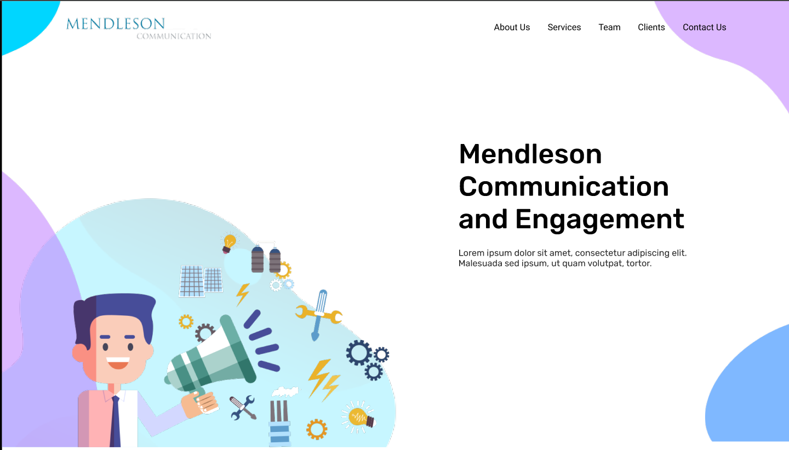

# One-Page Business Website



## 🌐 Live Demo
Check out the live demo [here](https://harimalam.github.io/Mendleson/dist).

## 📖 Overview
This is a responsive, modern one-page business website template designed with XHTML, SCSS, and JavaScript. It includes sections like Home, About, Services, Projects, Clients, Team, and Contact.

### **Features:**
- Clean and modern design
- Fully responsive layout
- Smooth scrolling navigation
- Animated section transitions
- Organized SCSS for easy customization
- Image optimization for fast loading

## 🛠️ Technologies Used
- **XHTML**: Markup language for the content structure.
- **SCSS**: CSS preprocessor for organized styling.
- **GitHub Pages**: Hosting for the live demo.

## 📂 Project Structure
```
├── dist/
│   ├── css/
│   │   ├── main.css
│   │   └── main.css.map
│   ├── img/
│   │   └── all images
│   └── index.xhtml
├── scss/
│   ├── _about.scss
│   ├── _clients.scss
│   ├── _contact.scss
│   ├── _projects.scss
│   ├── _services.scss
│   ├── _team.scss
│   └── main.scss
└── readme.md
```

## 🤝 Contributing
Contributions, issues, and feature requests are welcome! Feel free to check the issues page.

## 📄 License
This project is licensed under the MIT License.

## ✨ Contact
- **Name**: Malam Hari
- **GitHub**: [HariMalam](https://github.com/HariMalam)